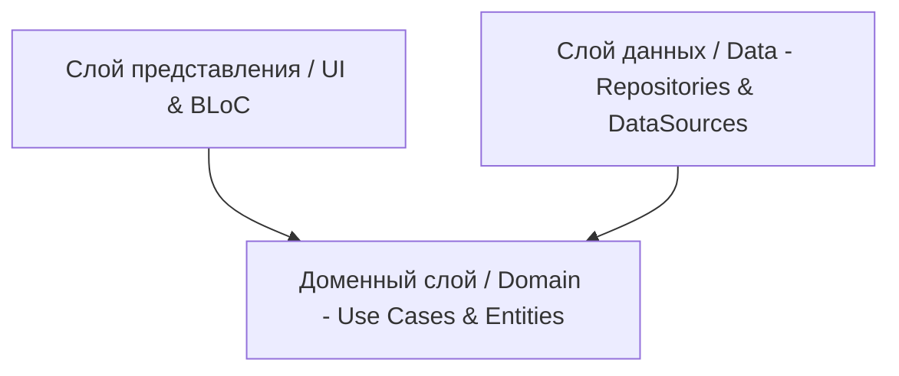

# Архитектура проекта: Медицинский графический редактор («раскраска» для УЗИ-врачей)

Проект разрабатывается на Flutter с использованием Clean Architecture и BLoC для управления состоянием.

## 1. Схема слоев Clean Architecture



## 2. Структура файлов проекта (Components & File Structure)

Проект структурирован по фичам (feature-first). Основная фича — `editor`.

```
lib/
├── core/                           # Общие утилиты, темы, DI
│   ├── di/                         # Регистрация зависимостей (get_it)
│   └── utils/                      # Хелперы для работы с архивами и платформенными API
├── features/
│   ├── library/                    # Фича выбора анатомических схем
│   └── editor/                     # Фича графического редактора
│       ├── domain/
│       │   ├── entities/           # Описание DrawAction, Project, ToolType
│       │   └── repositories/       # Интерфейс ProjectRepository
│       ├── data/
│       │   ├── models/             # Сериализация DrawActionModel, ProjectModel
│       │   ├── datasources/        # Проекты на диске, экспорт в галерею
│       │   └── repositories/       # Реализация ProjectRepository (SQLite / JSON / SAF)
│       └── presentation/
│           ├── bloc/               # DrawBloc (история, отмена/повтор), ProjectBloc (сохранение/загрузка)
│           ├── widgets/
│           │   ├── canvas/         # Холст, CustomPainter, обработка жестов
│           │   └── toolbox/        # Панель инструментов (кисти, штампы, ластик)
│           └── screens/
```

## 3. Компоненты слоя Представления (Presentation Layer)
- [canvas_widget.dart](file:///d:/projects/med_scheme/lib/features/editor/presentation/widgets/canvas/canvas_widget.dart): Компонент отрисовки. Использует `GestureDetector` для отслеживания ввода, `CustomPaint` для рендеринга. Локально буферизирует текущую рисуемую линию до момента `onPanEnd` (чтобы не перегружать BLoC частыми эвентами). Поддерживает Palm Rejection (игнорирует касания большой площадью/пальцем при рисовании стилусом) и силу нажатия (изменение ширины линии).
- [canvas_painter.dart](file:///d:/projects/med_scheme/lib/features/editor/presentation/widgets/canvas/canvas_painter.dart): Наследник `CustomPainter`. Использует `PathMetrics` для рисования сложных пунктирных и узорных путей ("колючая проволока" для инфильтрата, "паутина" для спаек).
- [draw_bloc.dart](file:///d:/projects/med_scheme/lib/features/editor/presentation/bloc/draw_bloc.dart): Управление состоянием холста:
  - Состояние: список выполненных действий (`List<DrawAction> history`), стек возврата (`List<DrawAction> redoStack`), выбранный инструмент (`ToolType`), текущий цвет.
  - События: `AddStrokeEvent`, `UndoEvent`, `RedoEvent`, `SelectToolEvent`, `ClearCanvasEvent`.

## 4. Доменный слой (Domain Layer)
- [draw_action.dart](file:///d:/projects/med_scheme/lib/features/editor/domain/entities/draw_action.dart): Базовое доменное представление действия на холсте. Наследники:
  - `StrokeAction` (обычная линия, ластик, "колючая проволока", "паутина" — со списком точек и шириной).
  - `ShapeAction` (овал для Эндометриомы или Миомы).
  - `StampAction` (штампы спирали/ВМС, пятна/очагов, пользовательских PNG).
  - `TextAction` (стрелки с текстовыми примечаниями).

## 5. Слой данных (Data Layer)
- [project_repository_impl.dart](file:///d:/projects/med_scheme/lib/features/editor/data/repositories/project_repository_impl.dart): Отвечает за:
  - Чтение/запись файлов `.meddraw`. Использует пакет `archive` в `compute` (изоляте) для упаковки JSON векторов действий и фонового изображения в ZIP.
  - Взаимодействие с Scoped Storage на Android через пакет `shared_storage` (запрос доступа к директории и сохранение persistable URI).
  - Запись в `getApplicationDocumentsDirectory()` на iOS с поддержкой интеграции с приложением "Файлы" через настройки `Info.plist`.
