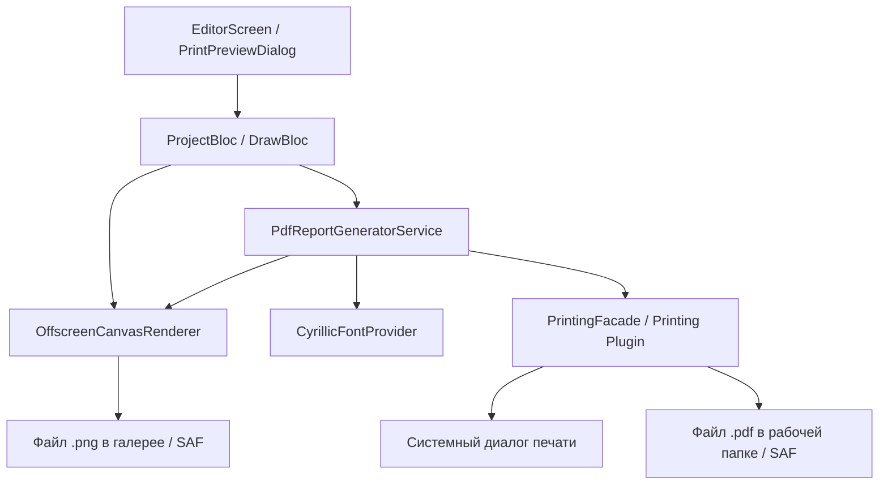

# Архитектура: Модуль печати и вёрстки медицинских отчетов (PDF & PNG)

## 1. Обзор архитектурного решения

Модуль предназначен для генерации профессиональных медицинских отчетов УЗИ-исследования с возможностью:
1. **Прямой отправки в печать** на физические принтеры (AirPrint на iOS, Android Print Services, Windows Spooler, Web print).
2. **Адекватной вёрстки PDF** в соответствии с медицинскими стандартами (A4 альбомная/книжная, поддержка кириллицы, шапка с данными пациента и клиники, высокочеткий рендеринг схем, авто-генерация клинической легенды по нанесенным маркерам, блок заключения врача).
3. **Качественного экспорта в PNG** (чистый срез без артефактов интерфейса либо брендированный медицинский бланк для МИС).

### Архитектурная диаграмма потоков данных:



---

## 2. Новые и модифицируемые компоненты (Components & File Structure)

### Новые компоненты:
1. **`lib/features/editor/domain/entities/report_config.dart`**:
   - Доменная сущность конфигурации отчета (ориентация листа, включение легенды, перечень страниц для вывода, ФИО врача, название клиники, текстовое заключение, выбор качества DPI).
2. **`lib/features/editor/domain/services/pdf_report_generator.dart`**:
   - Интерфейс сервиса генерации PDF документов.
3. **`lib/features/editor/data/services/pdf_report_generator_impl.dart`**:
   - Реализация вёрстки PDF на базе пакетов `pdf` и `printing`:
     - Загрузка кириллических шрифтов (`Roboto-Regular`, `Roboto-Bold`, `Roboto-Italic`).
     - Компоновка страниц: Header (пациент, дата, клиника), Body (схемы), Clinical Legend (только используемые маркеры), Notes (заключение врача), Footer (нумерация).
4. **`lib/features/editor/data/services/offscreen_canvas_renderer.dart`**:
   - Высококачественный оффскрин-рендерер холста:
     - Отрисовка на белом фоне с заданным DPI (150 / 300 DPI).
     - Генерация чистого PNG и PNG-бланка.
5. **`lib/features/editor/presentation/widgets/dialogs/print_export_dialog.dart`**:
   - Полнофункциональный диалог предпросмотра печати и экспорта с живым `PdfPreview` и выбором опций.

### Модифицируемые компоненты:
1. **[pubspec.yaml](file:///d:/projects/med_scheme/pubspec.yaml)**:
   - Добавление зависимости `printing: ^5.13.2` для кроссплатформенной печати и интеграции кириллических шрифтов.
2. **[project_repository.dart](file:///d:/projects/med_scheme/lib/features/editor/domain/repositories/project_repository.dart)**:
   - Расширение интерфейса методами `printReport()`, `generateReportPdf()`, `exportToHighResPng()`.
3. **[project_repository_impl.dart](file:///d:/projects/med_scheme/lib/features/editor/data/repositories/project_repository_impl.dart)**:
   - Внедрение вызовов `PdfReportGenerator` и `OffscreenCanvasRenderer`, поддержка сохранения многостраничных отчетов.
4. **[project_repository_web.dart](file:///d:/projects/med_scheme/lib/features/editor/data/repositories/project_repository_web.dart)**:
   - Веб-адаптация для печати через браузер и прямого скачивания обновленного PDF/PNG.
5. **[project_bloc.dart](file:///d:/projects/med_scheme/lib/features/editor/presentation/bloc/project_bloc.dart)**:
   - Новые события: `PrintReportEvent`, `ExportReportPdfEvent`, `ExportReportPngEvent`.
6. **[editor_screen.dart](file:///d:/projects/med_scheme/lib/features/editor/presentation/screens/editor_screen.dart)**:
   - Обновление меню верхнего тулбара: кнопка быстрой печати `🖨️ Печать` и вызов расширенного диалога экспорта.

---

## 3. Модели данных и спецификация макета (Data Models & Schemas)

### 3.1 `ReportConfig`
```dart
enum PageOrientation { portrait, landscape }
enum PngExportType { cleanScheme, fullMedicalCard }

class ReportConfig {
  final PageOrientation orientation;
  final bool includeHeader;
  final bool includeLegend;
  final bool includeOnlyActiveMarkersInLegend;
  final bool includeDoctorNotes;
  final String clinicName;
  final String doctorName;
  final String patientId;
  final String doctorNotes;
  final List<String> selectedPageIds; // фильтр страниц для многостраничного отчета
  final double dpiScale; // 1.0 (72 dpi), 2.0 (150 dpi), 3.0 (300 dpi)
  final PngExportType pngExportType;
}
```

### 3.2 Сетка и разметка PDF (A4 Medical Template)
- **Размер**: A4 (Landscape 297x210 mm / Portrait 210x297 mm), стандартные медицинские поля 10-12 mm.
- **Цветовая палитра для печати**:
  - Фон: `#FFFFFF` (белый).
  - Текст: `#1A1A1A` (глубокий темно-серый, контрастный).
  - Акценты: `#0F4C81` (фирменный медицинский темно-синий для разделителей и шапки).
- **Структура страницы отчета**:
  ```
  +-------------------------------------------------------------------------+
  | [Лого/Название Клиники]                [Протокол УЗИ / Дата и Время]     |
  | Пациент: ID 12345                      Врач: Иванов И.И.                 |
  |-------------------------------------------------------------------------|
  |                                                                         |
  |   +-------------------------------+  +-------------------------------+  |
  |   |                               |  |                               |  |
  |   |      СХЕМА: ТАЗ (АКСИАЛ)      |  |     СХЕМА: САГИТТАЛЬНЫЙ СРЕЗ  |  |
  |   |                               |  |                               |  |
  |   +-------------------------------+  +-------------------------------+  |
  |                                                                         |
  |-------------------------------------------------------------------------|
  | КЛИНИЧЕСКАЯ ЛЕГЕНДА:                                                    |
  | [●] Эндометриома   [⌇] Инфильтрат   [■] Спайки   [▲] Очаги   [Т] ВМС     |
  |-------------------------------------------------------------------------|
  | ЗАКЛЮЧЕНИЕ / ПРИМЕЧАНИЯ:                                                |
  | Текст заключения врача...                                               |
  |                                                  Стр. 1 из 1            |
  +-------------------------------------------------------------------------+
  ```

---

## 4. Поддержка кириллицы и шрифтовой движок
В `pdf` виджетах стандартные шрифты Helvetica не содержат глифов кириллицы. Для надежности:
1. Использование `PdfGoogleFonts.robotoRegular()`, `PdfGoogleFonts.robotoBold()`, `PdfGoogleFonts.robotoMedium()`.
2. Fallback: загрузка локального ttf-шрифта из `assets/fonts/` в случае отсутствия интернет-соединения в закрытых медицинских сетях.

---

## 5. Интеграция с печатью (Printing Integration)
- Вызов `Printing.layoutPdf(...)` с генератором документа:
  ```dart
  await Printing.layoutPdf(
    name: 'УЗИ_${patientId}_${DateTime.now().millisecondsSinceEpoch}',
    onLayout: (PdfPageFormat format) async => await pdfReportGenerator.generateBytes(config, projectData),
  );
  ```
- Для предпросмотра используется `PdfPreview` виджет с кастомными кнопками действий.
